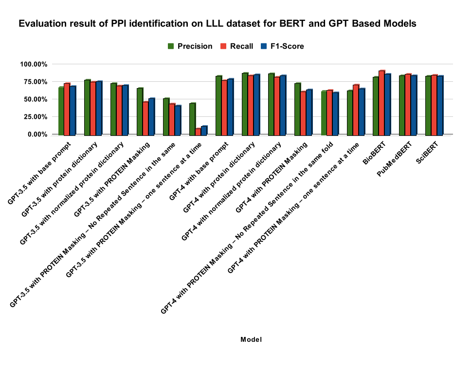
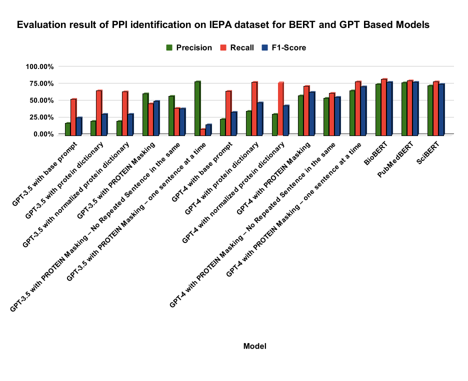
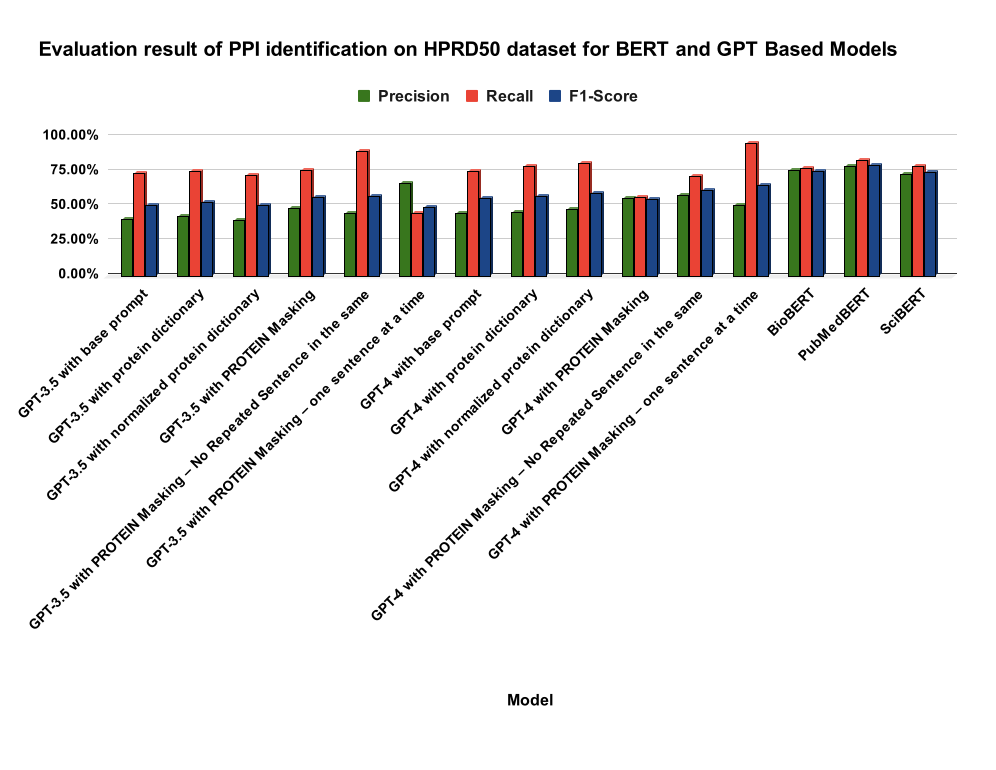

# GPT-PPI
 Application of Generative Pretrained Transformer (GPT) on identifying protein-protein interactions in biomedical text

# Dataset
we employed three widely used datasets for PPI extraction: LLL, IEPA, and HPRD50. These gold-standard datasets offer a unique perspective and challenge in biomedical NLP research, particularly in PPI extraction. 

Table 1. Number of positive and negative pairs in the sentences of the three datasets.  
| Dataset | Number of Sentences | Positive Pairs | Negative Pairs | Total Pairs | Positive:Negative |
|---------|---------------------|----------------|----------------|-------------|-------------------|
| LLL     | 77                  | 164            | 166            | 330         | 1:1.0             |
| IEPA    | 486                 | 335            | 482            | 817         | 1:1.4             |
| HPRD50  | 145                 | 163            | 270            | 433         | 1:1.6             |

# Comparative Results

  
  
  

# Acknowledgment
The study was supported by the U.S. National Institute of Allergy and Infectious Disease (U24AI171008 to Y.H. and J.H.). GEBIP Award of the Turkish Acade-my of Sciences (to A.Ö.) is gratefully acknowledged.
